# Segment BT — Groot2 Şemaları (Düzeltilmiş)

> Bu doküman `segment_bt.xml` dosyasındaki tüm alt-ağaçları Groot2'de görüneceği
> hiyerarşik yapıda gösterir. **Düzeltilmiş versiyondur** — Roundabout, PassengerStop,
> HandleStaticObstacle ve ValidateTurn hataları giderilmiştir.

---

## 1. MainTree (Ana Ağaç)

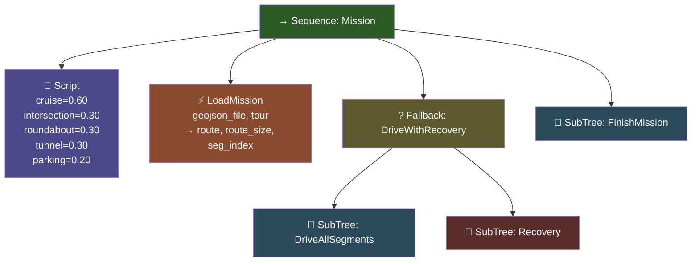

---

## 2. DriveAllSegments (Segment Döngüsü)

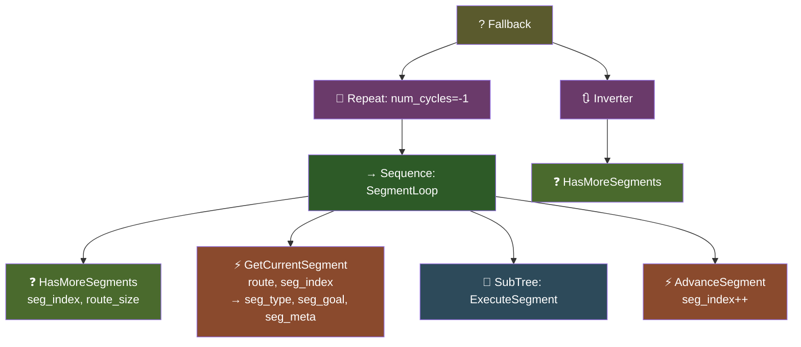

---

## 3. ExecuteSegment (Segment Router — Switch/Case)

```mermaid
graph TD
    FB["? Fallback: SegmentSwitch"]
    
    FB --> S1["→ Seq"]
    S1 --> C1["❓ IsSegmentType<br/>expected=LANE_FOLLOW"]
    S1 --> T1["🌲 Seg_LaneFollow"]

    FB --> S2["→ Seq"]
    S2 --> C2["❓ IsSegmentType<br/>expected=INTERSECTION"]
    S2 --> T2["🌲 Seg_Intersection"]

    FB --> S3["→ Seq"]
    S3 --> C3["❓ IsSegmentType<br/>expected=ROUNDABOUT"]
    S3 --> T3["🌲 Seg_Roundabout"]

    FB --> S4["→ Seq"]
    S4 --> C4["❓ IsSegmentType<br/>expected=TUNNEL"]
    S4 --> T4["🌲 Seg_Tunnel"]

    FB --> S5["→ Seq"]
    S5 --> C5["❓ IsSegmentType<br/>expected=PASSENGER_STOP"]
    S5 --> T5["🌲 Seg_PassengerStop"]

    FB --> S6["→ Seq"]
    S6 --> C6["❓ IsSegmentType<br/>expected=LANE_CHANGE"]
    S6 --> T6["🌲 Seg_LaneChange"]

    FB --> S7["→ Seq"]
    S7 --> C7["❓ IsSegmentType<br/>expected=PARKING"]
    S7 --> T7["🌲 Seg_Parking"]

    style FB fill:#5a5a2d,color:#fff
    style C1 fill:#4a6a2d,color:#fff
    style C2 fill:#4a6a2d,color:#fff
    style C3 fill:#4a6a2d,color:#fff
    style C4 fill:#4a6a2d,color:#fff
    style C5 fill:#4a6a2d,color:#fff
    style C6 fill:#4a6a2d,color:#fff
    style C7 fill:#4a6a2d,color:#fff
    style T1 fill:#2d4a5a,color:#fff
    style T2 fill:#2d4a5a,color:#fff
    style T3 fill:#2d4a5a,color:#fff
    style T4 fill:#2d4a5a,color:#fff
    style T5 fill:#2d4a5a,color:#fff
    style T6 fill:#2d4a5a,color:#fff
    style T7 fill:#2d4a5a,color:#fff
```

---

## 4. SafeDrive (Güvenli Hareket Primitifi)

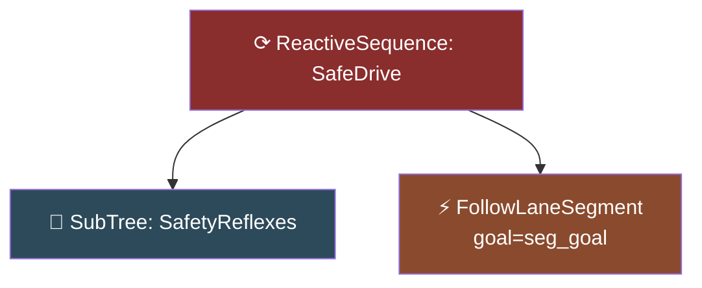

---

## 5. SafetyReflexes (Güvenlik Katmanı)

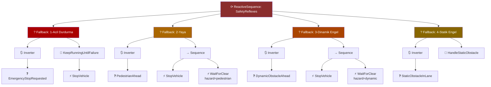

---

## 6. HandleStaticObstacle (✅ DÜZELTİLDİ)

> **Düzeltme:** `CalculateLaneChange` sonrası `FollowLaneSegment` eklendi — artık hesaplanan hedefe gerçekten gidiliyor.

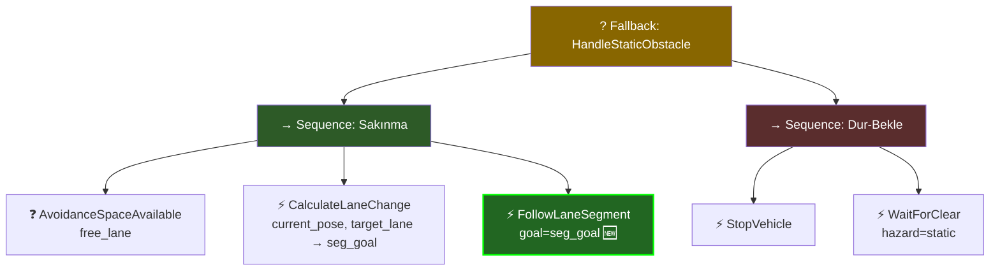

---

## 7. Seg_LaneFollow (Düz Şerit Takibi)

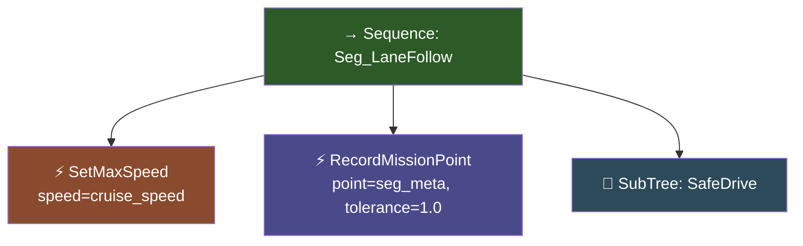

---

## 8. Seg_Intersection (Kavşak)

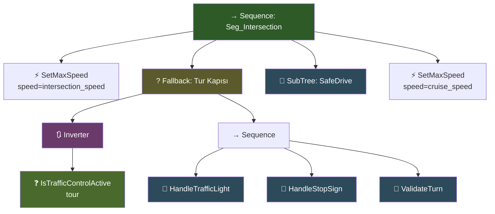

---

## 9. HandleTrafficLight (Işık Yönetimi)

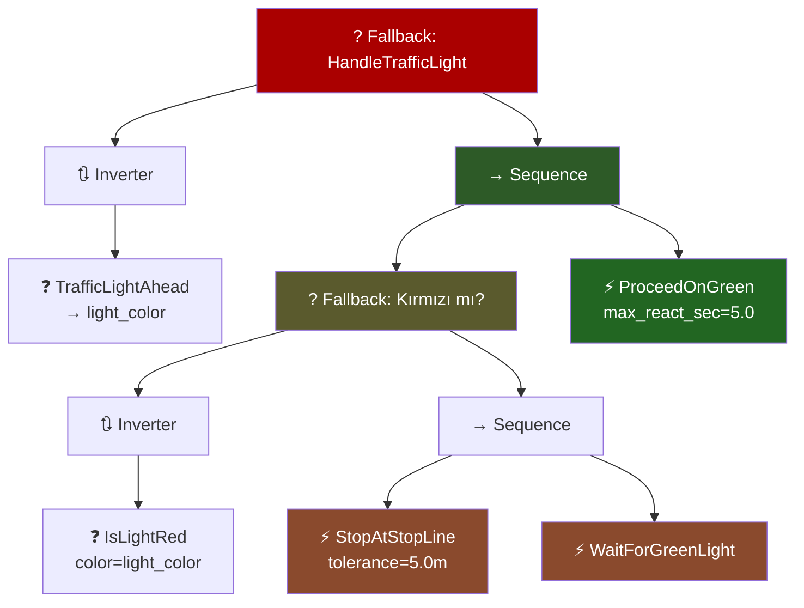

---

## 10. HandleStopSign & ValidateTurn (✅ DÜZELTİLDİ)

> **Düzeltme:** `ValidateTurn`'de `ReplanRoute` artık `ForceSuccess` ile sarılı — başarısız olsa bile segment loop crash etmez.

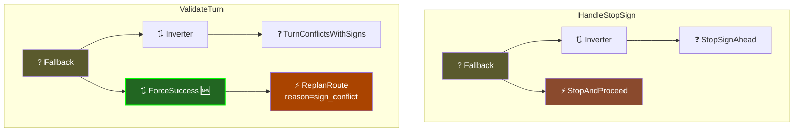

---

## 11. Seg_Roundabout (✅ DÜZELTİLDİ)

> **Düzeltme:** `ExecuteRoundabout` yerine `SafeDrive` SubTree kullanılıyor — artık dönel kavşak içinde de güvenlik refleksleri çalışır.

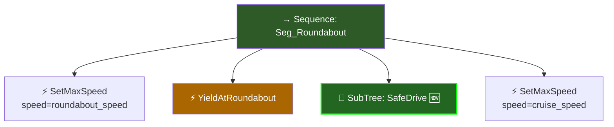

---

## 12. Seg_Tunnel (Tünel)

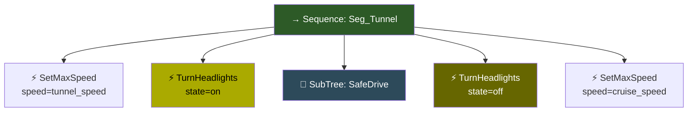

---

## 13. Seg_PassengerStop (✅ DÜZELTİLDİ)

> **Düzeltme:** `CheckStopAccuracy` FAILURE dönerse pozisyon düzeltme döngüsü eklendi.

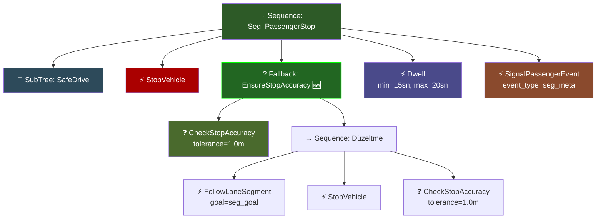

---

## 14. Seg_LaneChange (Şerit Değişimi)

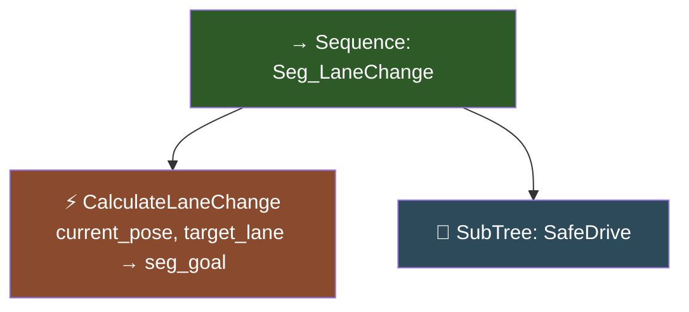

---

## 15. Seg_Parking (Park)

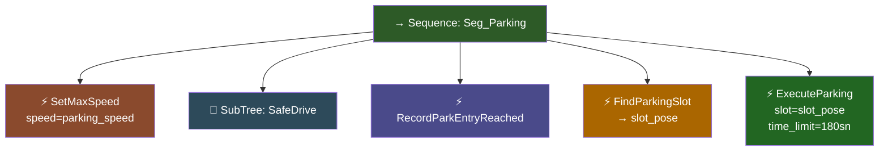

---

## 16. Recovery & FinishMission

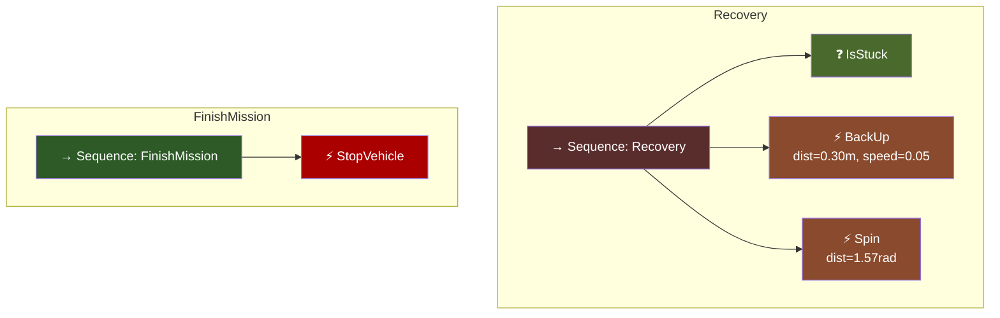

---

## Düzeltme Özeti

| # | Sorun | Düzeltme | Diyagram |
|---|---|---|---|
| 1 | Roundabout'ta SafeDrive eksik | `SafeDrive` SubTree eklendi | §11 |
| 2 | PassengerStop pozisyon düzeltme yok | `EnsureStopAccuracy` Fallback eklendi | §13 |
| 3 | HandleStaticObstacle hareket eksik | `FollowLaneSegment` eklendi | §6 |
| 4 | ValidateTurn ReplanRoute crash riski | `ForceSuccess` sarmalı eklendi | §10 |

---

## Groot2'de Açma Talimatı

1. `segment_bt.xml` dosyasını Groot2'de açın: **File → Open**
2. Format: `BTCPP_format="4"` — Groot2 bunu native olarak destekler
3. `TreeNodesModel` bloğu XML içinde gömülü → custom node'lar port'larıyla görünecektir
4. Sol panelde alt-ağaç listesinden her SubTree'ye çift tıklayarak detayına inebilirsiniz
5. 🆕 işaretli node'lar düzeltme ile eklenen yeni elemanlardır
